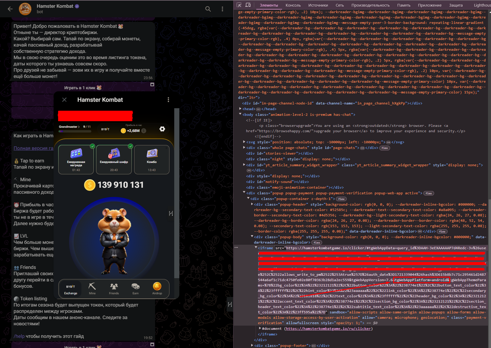

# Humster Auto Clicker

### Возможности
- автотап каждые 230 секунд. Настраивается индивидуально в зависимости от вашей энергии. Чтобы подсчитать необходимо разделить энергию на 3 и прибавить 30. 30 - для надежности. Например энергия 6000, делим на 3 и прибавляем 30, получаем 230
- синхронизация прибыли в час
- применение буста энергии 6 раз в сутки.

### Настройка окружения
- Создайте `.env` файл, пример переменных указаны в `.env.sample`
- Установите зависимости `npm install`
- Добавить токен (пункт ниже)
- Запустить приложение `npm run start`

### Получение токена
Для получения токена необходимо открыть приложение Humster Combat в браузере. Чтобы убрать уведомление о необходимости запускать приложение через телефон необходимо подменить query параметр `tgWebAppPlatform` на, например, `android`

Далее переходим на вкладку network и смотрим любой запрос по api, находим bearer токен и сохраняем его в `.env` переменные
